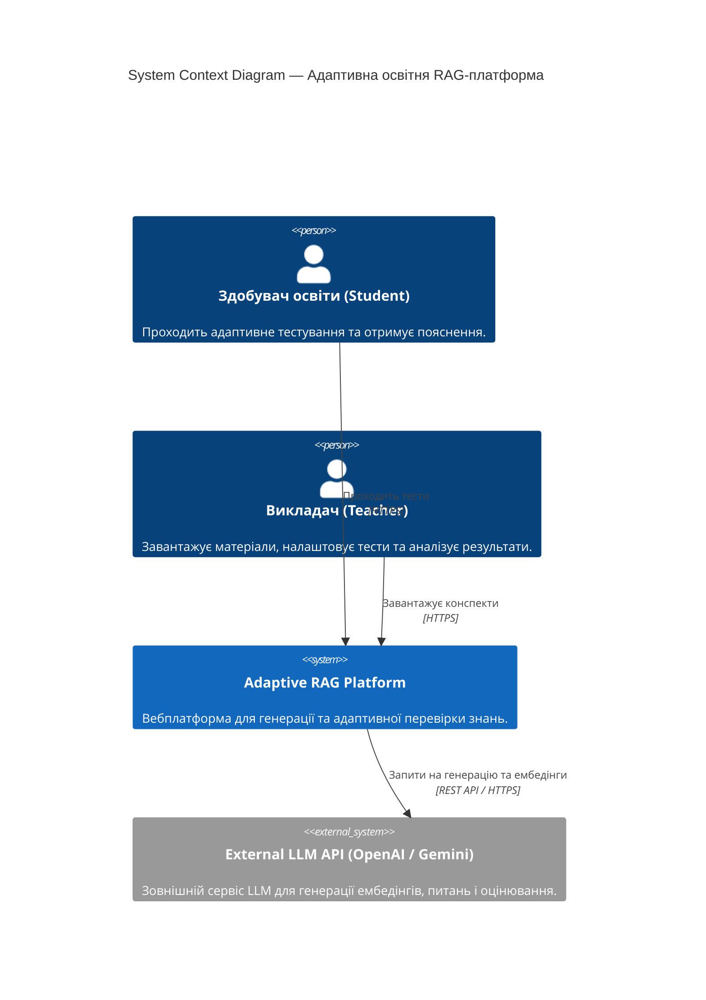
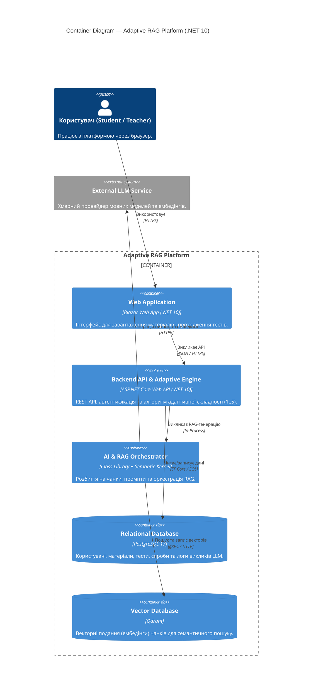

# Архітектура системи (C4-модель)

## 1. System Context Diagram (Контекст системи)

```mermaid
C4Context
    title System Context Diagram — Адаптивна освітня RAG-платформа

    Person(student, "Здобувач освіти (Student)", "Проходить адаптивне тестування та отримує пояснення.")
    Person(teacher, "Викладач (Teacher)", "Завантажує матеріали, налаштовує тести та аналізує результати.")

    System(ragPlatform, "Adaptive RAG Platform", "Вебплатформа для генерації та адаптивної перевірки знань.")

    System_Ext(llmProvider, "External LLM API (OpenAI / Gemini)", "Зовнішній сервіс LLM для генерації ембедінгів, питань і оцінювання.")

    Rel(student, ragPlatform, "Проходить тести", "HTTPS")
    Rel(teacher, ragPlatform, "Завантажує конспекти", "HTTPS")
    Rel(ragPlatform, llmProvider, "Запити на генерацію та ембедінги", "REST API / HTTPS")

    UpdateLayoutConfig($c4ShapeInRow="2", $c4BoundaryInRow="1")
```

## 2. Container Diagram (Контейнери системи)

```mermaid
C4Container
    title Container Diagram — Adaptive RAG Platform (.NET 10)

    Person(user, "Користувач (Student / Teacher)", "Працює з платформою через браузер.")

    Container_Boundary(c1, "Adaptive RAG Platform") {
        Container(webApp, "Web Application", "Blazor Web App (.NET 10)", "Інтерфейс для завантаження матеріалів і проходження тестів.")
        Container(webApi, "Backend API & Adaptive Engine", "ASP.NET Core Web API (.NET 10)", "REST API, автентифікація та алгоритм адаптивної складності (1..5).")
        Container(aiModule, "AI & RAG Orchestrator", "Class Library + Semantic Kernel", "Розбиття на чанки, промпти та оркестрація RAG.")
        ContainerDb(postgresDb, "Relational Database", "PostgreSQL 17", "Користувачі, матеріали, тести, спроби та логи викликів LLM.")
        ContainerDb(qdrantDb, "Vector Database", "Qdrant", "Векторні подання (ембедінги) чанків для семантичного пошуку.")
    }

    System_Ext(llmApi, "External LLM Service", "Хмарний провайдер мовних моделей та ембедінгів.")

    Rel(user, webApp, "Використовує", "HTTPS")
    Rel(webApp, webApi, "Викликає API", "JSON / HTTPS")
    Rel(webApi, postgresDb, "Читає/записує дані", "EF Core / SQL")
    Rel(webApi, aiModule, "Викликає RAG-генерацію", "In-Process")
    Rel(aiModule, qdrantDb, "Пошук та запис векторів", "gRPC / HTTP")
    Rel(aiModule, llmApi, "Генерація питань та ембедінгів", "HTTPS")

    UpdateLayoutConfig($c4ShapeInRow="2", $c4BoundaryInRow="1")
```
